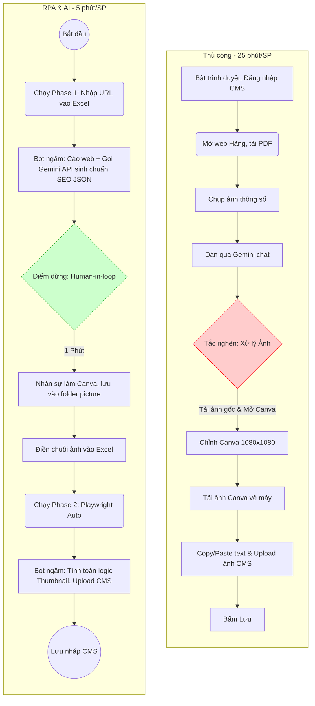
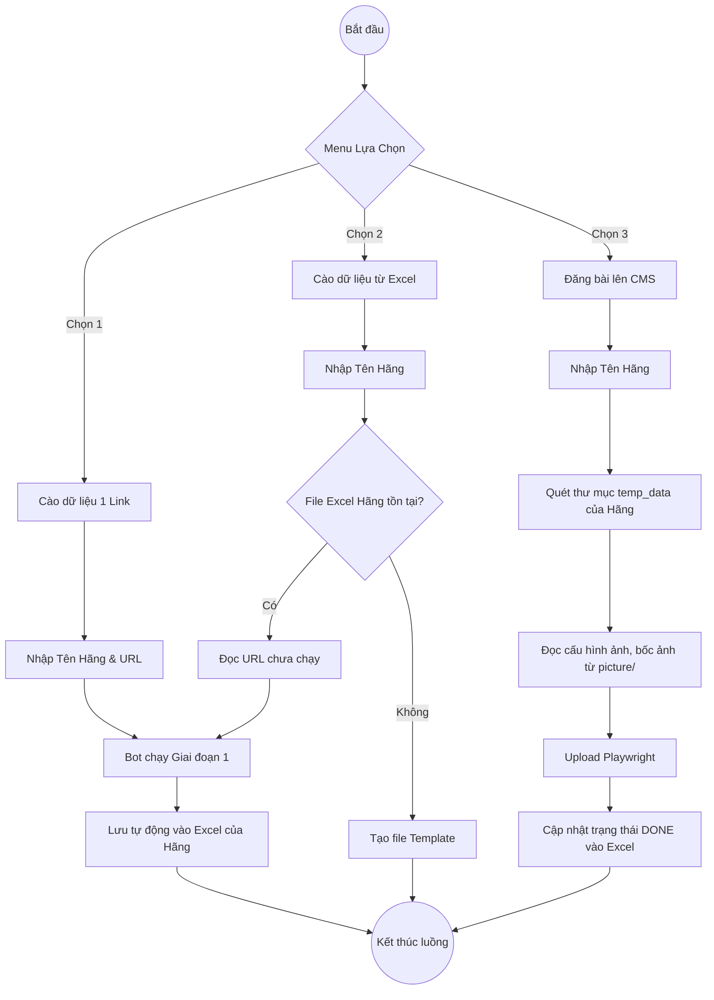

SmartPost Robotic Process Automation


Dự án tự động hóa (RPA) 2 giai đoạn giúp cào dữ liệu sản phẩm thiết bị HoReCa, tự động dịch, viết content chuẩn SEO bằng AI và đăng tải trực tiếp lên CMS. Rút ngắn thời gian xử lý từ 25 phút xuống chỉ còn 5 phút/sản phẩm!

# Tài liệu Phát triển Sản phẩm

---

## 1. Tài liệu hóa Yêu cầu


### Epic 1: Chuẩn hóa Nội dung AI
**US 1.1: Trích xuất Keyword SEO**
> **As a** Nhân viên Marketing,  
> **I want** AI trả về chính xác 10 từ khóa SEO viết thường dựa trên catalog tiếng nước ngoài,  
> **so that** tôi không bao giờ mắc lỗi "quên từ khóa" và sản phẩm dễ dàng lọt Top Google.

**Acceptance Criteria:**
- **AC1:** Output JSON phải có key `seo_keywords` chứa đúng 10 cụm từ, phân cách bằng dấu phẩy.
- **AC2:** Toàn bộ ký tự trong mảng keyword phải là chữ thường (lowercase).
- **AC3:** Không xuất hiện tên thương hiệu gốc (như Suzumo, Nayati) trong danh sách.

**US 1.2: Định dạng văn bản HTML chuẩn SEO**
> **As a** Quản trị viên CMS,  
> **I want** nội dung sinh ra được đóng gói sẵn các thẻ HTML (`<h2>`, `<p>`, `<strong>`),  
> **so that** tôi có thể paste thẳng vào mã nguồn CKEditor mà không bị vỡ bố cục hiển thị.

**Acceptance Criteria:**
- **AC1:** Bài viết phải có đoạn Sapo tối đa 4 dòng, chứa từ khóa chính ở 150 ký tự đầu.
- **AC2:** Sử dụng thẻ `<strong>` thay vì dấu `**` của Markdown.
- **AC3:** Dữ liệu mô tả ngắn (`short_desc`) không được vượt quá 400 ký tự.

### Epic 2: Đồng bộ Hỗn hợp
**US 2.1: Gom ảnh thông minh từ Excel**
> **As a** Nhân viên Nhập liệu / Thiết kế,  
> **I want** khai báo cấu hình ảnh (ví dụ "1-3, 5") trong Excel sau khi đã thiết kế xong bằng Canva,  
> **so that** Bot tự động bốc đúng số lượng ảnh tương ứng làm Thumbnail và Gallery mà không bắt tôi up thủ công.

**Acceptance Criteria:**
- **AC1:** Thuật toán phân tách được chuỗi điều kiện chứa dấu `-` và dấu `,`.
- **AC2:** File ảnh có con số nhỏ nhất trong danh sách trích xuất MẶC ĐỊNH trở thành Thumbnail (`Tên Sản Phẩm 1.jpg`).

---

## 2. Mô hình hóa Chức năng

### User Story Mapping
Sắp xếp theo Hành trình người dùng để xác định MVP và các bản phát hành.

| Tác vụ | 1. Xử lý Dữ liệu thô | 2. Sinh Content (AI) | 3. Chuẩn bị Hình ảnh | 4. Đăng tải CMS |
| :--- | :--- | :--- | :--- | :--- |
| **MVP** | Quét PDF bằng tay | Đẩy prompt cơ bản lên AI | Tải ảnh về, chọn thủ công | Dán tay lên CMS |
| **Release 1** | Bot tự cào Text/PDF qua URL | Prompt kỹ thuật số 1: Tên SP tiếng Việt | Đổi tên `1.jpg` tự động | Playwright tự login & điền form liền mạch |
| **Release 2** <br>*(Hiện tại)* | Phân rã luồng thành Phase 1 riêng biệt để tránh lỗi | Chuẩn hóa JSON: SEO Keywords, HTML Tags, chống Hallucination | **Canva Workflow:** Cho phép dừng lại thiết kế. Dùng Excel điều phối ảnh | Tách Phase 2. Tự tính toán logic Thumbnail. |
| **Release 3** <br>*(Tương lai)* | Đọc mã vạch/Mã QR từ catalog | Tự chèn Internal/External Links vào bài viết | Tự động tải ảnh chất lượng cao từ Google Images | Auto-Publish thay vì Lưu nháp |

---

## 3. Mô hình hóa Quy trình

### 3.1. Sơ đồ Quy trình Nghiệp vụ (BPMN)




### 3.2. User Flow





## 🚀 Hướng Dẫn Nhanh (Quick Start)
### 1. Cài đặt môi trường
```bash
pip install -r requirements.txt
```
### 2. Cấu hình biến môi trường
Tạo file `.env` dựa trên file `.env.example` và điền các thông tin:
- `GEMINI_API_KEY`: API Key của Google Gemini
- `CMS_EMAIL` & `CMS_PASSWORD`: Tài khoản đăng nhập CMS
### 3. Chạy chương trình
```bash
python main.py
```
Menu tương tác sẽ hiện ra cho phép bạn chọn chạy Giai đoạn 1 (Thu thập dữ liệu & AI) hoặc Giai đoạn 2 (Tự động tải ảnh & Post lên CMS).
